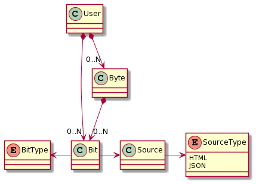
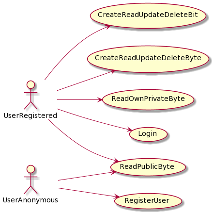

Analysis
======================================================================

Domain Model
------------

Use Cases
------------

Rules
-----

* A bit is the minimal unity of information

* Any Bit in system has to be refreshed at most every 10 minutes

* A byte can contain at least 1 Bit and at most 8 Bits

* A registered user can create at most 5 Bytes

* When create a new Bit, check for Source and Resource, if exists return the existing Bit, else create a new one.

* Source.unique_id is the unique identifier of that resource, in XPATH case: "//*[@id="Capa_1-2"]/path[1]"

* same user can't have 2 Bytes with same name

* same byte can't have 2 equals bits
